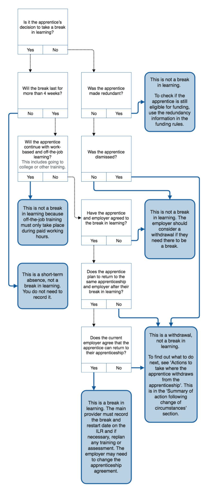

{: .no_toc }

# Apprenticeships - Learning Breaks & Withdrawal

### Advice to give to an Apprentice

* Note that Withdrawal from Study means permanently ceasing your studies on this course at Solent University
* You could consider a break in learning/suspension of studies rather than withdrawing from your apprenticeship.
* You can seek guidance from your course leader, or a tutor, or speak to your employer.

### Advice to give to an Employer

* In accordance with education and skills funding agency (ESFA) Guidelines, it is the employer’s responsibility to notify the training provider of the withdrawal or break in learning for one of their apprentices.
* You are advised to review the ESFA rules before completing this form.
* Please note that you are responsible for amending the DAS to show this withdrawal.

For more details contact the apprentice office: apprenticeships@solent.ac.uk

Please use the appropriate form below, the apprentice and their employer needs to fill in the appropriate fields and send on to the Course Leader martin.reid@solent.ac.uk to sign off and process.

[Download Withdrawal Form](https://ssu-my.sharepoint.com/:w:/g/personal/martin_reid_solent_ac_uk/EZ55Z7-p6oZNhxD8kSz74fQBPFOQTKRj3snpd7X5bZHWaA?e=024IRJ){: .btn .btn-purple } 

[Download Break in Learning Form](https://ssu-my.sharepoint.com/:w:/g/personal/martin_reid_solent_ac_uk/Ee9w_t9gBIZNm08u8aqy5oQBCQX6Bb2hxEWsLV0TZGIbOA?e=oHAPML){: .btn .btn-purple } 

[Download Return to Studies From](9https://ssu-my.sharepoint.com/:w:/g/personal/martin_reid_solent_ac_uk/EUQNN_9EIqdBo6sqBGSvf2ABF-rHfoAjNG6_El6t4OeA-A?e=3Qzrqn){: .btn .btn-purple } 

## Apprenticeship funding rules and guidance:

[Apprenticeship funding rules and guidance for employers August 2021 to July 2022](https://assets.publishing.service.gov.uk/government/uploads/system/uploads/attachment_data/file/1007542/2122_Employer_Rules_Version_1.pdf)

[Apprenticeship funding rules for employer-providers August 2021 to July 2022](https://assets.publishing.service.gov.uk/government/uploads/system/uploads/attachment_data/file/1007543/2122_Employer-Provider_Rules_Version_1.pdf)

[Apprenticeship funding rules for main providers August 2021 to July 2022
](https://assets.publishing.service.gov.uk/government/uploads/system/uploads/attachment_data/file/1007548/2021-07-28_-_2122_Provider_Rules_Version_Version_1.pdf)

 

