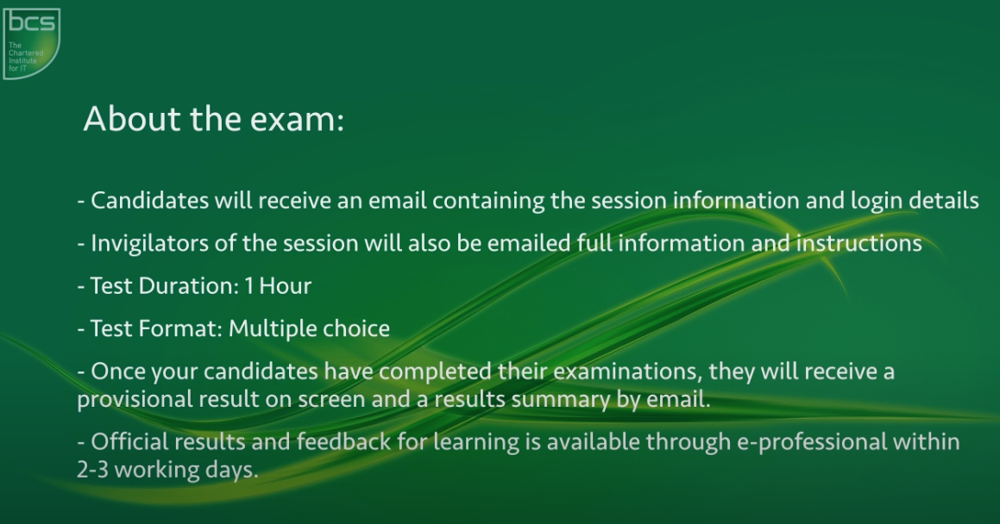
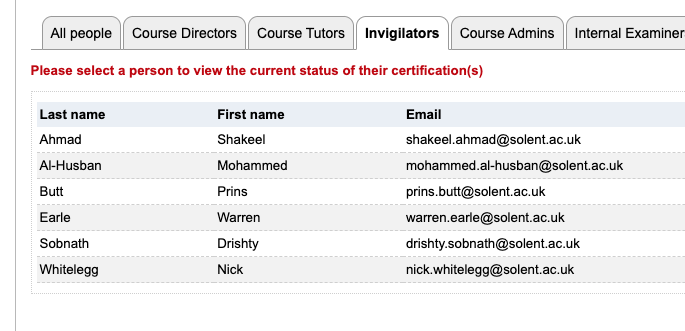

{: .no_toc }

# Apprenticeships - Data Knowledge Modules

## Delivering Digital IT Apprenticeships using e-Professional

These are for the knowledge modules for the level for data Analysis Apprenticeship Students - this only applies to students on the old standard as they have been removed from the new standard which updated summer 2021.

Exams to be done:

1. BCS Level 4 Diploma in Data Concepts (603/0823/0) 
1. BCS Level 4 Certificate in Data Analysis tools (603/0824/2)

[eprofessional BCS Dashboard](https://eprofessional.bcs.org/Portal/Dashboard)

**Super User/Manger:** Martin Reid - Has the rights to set up exam sessions and at candidates.

Kenton Wheeler is the tutor

**Invigilators:**

Nick Whitelegg, Warren Earle, Prins Butt, Shakeel Ahmed, & Drishty Sobnath

They are all registered and have done the training with Nick undertaking 3 invigilators already (at 30/6/2021)

### Organisation of exam session & individuation

With Covid regulations and visualisation will be taking place online and the invigilator requires the candidates to have the WebCam switched on. No need for Screen Sharing and a group of candidates can be invigilator at one time.

**Each of the exam lasts 1 hour** - although students usually only take** 40 to 45 minutes.**

They do need to **download software from the BCS** to their computer which means that using their own personal computer is advised as they may not have admin rights to their work laptops.

**They will be invited to the team session 15 minutes** before the test starts this will give time to set everything up including them downloading software and also the invigilator authorising them to take the test.

If they start late - don't worry as the hour slot only starts once they commence the test

The following [BCS videos](https://www.youtube.com/watch?v=4NP5zjatpkQ&ab_channel=BCS%2CTheCharteredInstituteforIT) guide through the processes the manager/superuser needs to add tutors, invigilators, set up exam sessions and add candidates.

### Adding Tutors and Invigilators (3:50)

<iframe width="560" height="315" src="https://www.youtube.com/embed/4NP5zjatpkQ?start=233" title="YouTube video player" frameborder="0" allow="accelerometer; autoplay; clipboard-write; encrypted-media; gyroscope; picture-in-picture" allowfullscreen></iframe>

### Book Exam Session

<iframe width="560" height="315" src="https://www.youtube.com/embed/4NP5zjatpkQ?start=458" title="YouTube video player" frameborder="0" allow="accelerometer; autoplay; clipboard-write; encrypted-media; gyroscope; picture-in-picture" allowfullscreen></iframe>

### Adding candidates to exam session

<iframe width="560" height="315" src="https://www.youtube.com/embed/4NP5zjatpkQ?start=672" title="YouTube video player" frameborder="0" allow="accelerometer; autoplay; clipboard-write; encrypted-media; gyroscope; picture-in-picture" allowfullscreen></iframe>

### Information for Apprentice side set-up

You will have to do download software to take the test so if you are using a work computer and don’t have admin rights - we recommend you use your own computer. The invigilator will need to see you working on your exam they do not need to see your screen/have your screen shared. 

As a backup, we recommend you have your phone available so you can use MS Team App as a backup to video share if there are any issues are running teams and the exam side-by-side on your computer.

<iframe width="560" height="315" src="https://www.youtube.com/embed/-KV_UoS-nRI" title="YouTube video player" frameborder="0" allow="accelerometer; autoplay; clipboard-write; encrypted-media; gyroscope; picture-in-picture" allowfullscreen></iframe>

**On the day of the exam**

Before joining the arranged Teams meeting you should sign into the BCS portal:

From your BCS account, you will then need to go to ‘upcoming exams’ and select the exam you will be taking. Follow the Questionmark instructions to initiate the exam. This will not start the exam until your invigilator has given you an access code.

Ensure you do not have any other applications on your PC open as this will prevent you from running the Questionmark software. You will have to close any programs running in background mode. Questionmark will inform you of any applications that need to be closed.

Please join the Team meeting which has been set to start 15-20 minutes before the exam it is due to start to allow time for onboarding.

**Onboarding**

The invigilator will greet you and check your ID and your exam environment. You must be the only person in the room with a clear desk other than some notepaper and a pen or pencil. You may use the notepad during the exam if needed.

The invigilator will provide you with an access code to start the exam.

During the exam, you will need to stay connected to both the Teams meeting and the exam. You will not be able to see your tutor during the exam as the Questionmark software will block this, but your tutor will still be able to see you so that they can invigilate the exam as they would if you were in a classroom environment. You will be expected to keep your microphone switched on during the exam. You may want to turn your own volume down so that you are not disturbed by noise from other candidates.

Navigating through the exam is relatively intuitive. Questions are answered on-screen by clicking on one of the 4 answers displayed on the screen. There should be an amount of time left displayed at the top of the screen. There is also an option to ‘flag’ a question that you want to go back to later. We recommend that you make the best guess at every question before flagging it. The Questionmark software will allow you to navigate backward and forwards through the exam and go back to flagged questions.

Ensure that you attempt every question.

**At the end of the exam**

You can terminate the exam before the time expires but we do not recommend this. Otherwise, the exam will finish at the end of the allocated time.

Your exam result will be displayed immediately. The result will remain pending until it has been processed by BCS which can take a day or so.