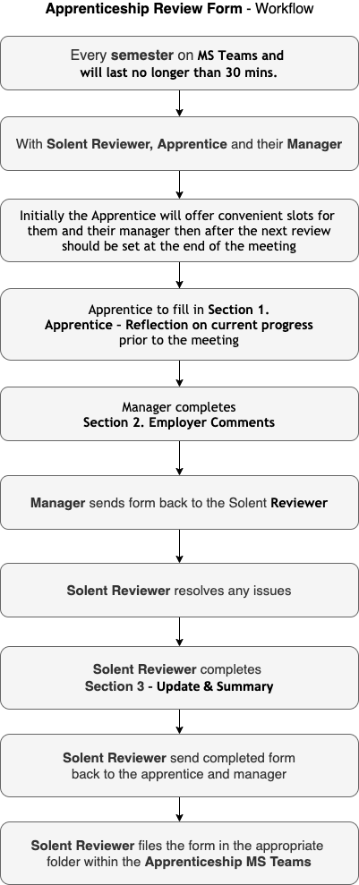

{: .no_toc }

# Apprenticeships - Reviews

Tripartite review meetings take place regularly throughout the apprenticeship and are usually held every semester. 

At tripartite review meetings the apprentice, their employer, and an academic formally meet to assess progress and ensure that the apprentice is on track both in terms of their academic programme and their work-based learning. 

The review meetings will track progress against the knowledge, skills and behaviours gained in the apprenticeship.  They provide an opportunity to agree on any changes required to the apprentice’s learning plan and identify any actions needed to ensure the success of the apprenticeship.

Review meetings are undertaken by Kenton Wheeler and Martin Reid

## Review meeting workflow

Apprenticeship reviews with the apprentice and their manager take place every semester, they will take place online lasting between 20 and 30 minutes there is a form to be filled with contributions from the apprentice, the manager, and the university reviewer. Following the meeting, if there are any issues they will need to be resolved.

Initially, the Solent Reviewer to get the apprentice to arrange a convenient time for them and their manager to undertake the review. This will avoid any issues if the manager has changed and the reviewer is unaware of this. For future meetings, the next date will be agreed at the end of each review

The reviewer should highlight:

* Keeping up-to-date with the 20%-off-the-job tracker on SOL
* Keeping up-to-date with portfolio
* 2nd-year apprentices should start thinking about a Synoptic Project topic that is undertaken in the 3rd year.

[Down review from](https://ssu-my.sharepoint.com/:w:/g/personal/martin_reid_solent_ac_uk/ETKKHmQtJv9KqkEedVj8eDQBD7VkdlG5nWKRL0NL6l68qw?e=ICr0fR){: .btn .btn-purple } 

[Review strategy (work in progress)](https://ssu-my.sharepoint.com/:w:/g/personal/martin_reid_solent_ac_uk/EV637lpel7hNl5scbSJqFVMBtecFyrbgStiQcqTlX7vBXw?e=A4jKDA)