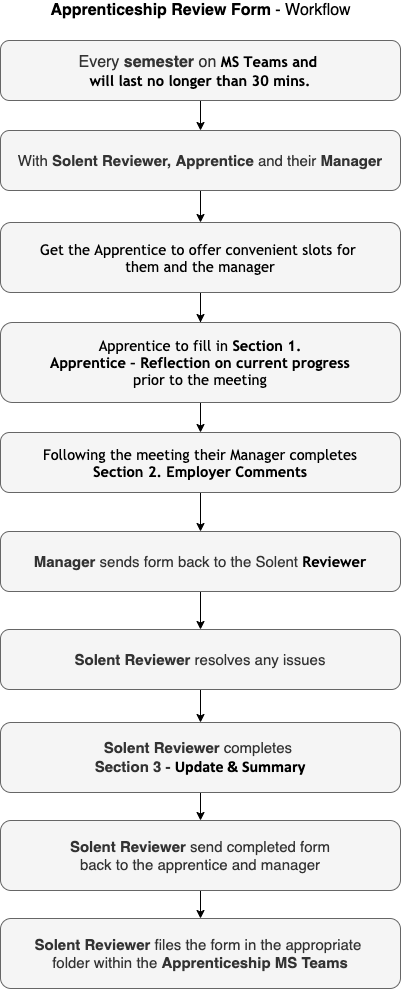

{: .no_toc }

# Apprenticeships - Reviews

Apprenticeship reviews with apprentice and their manager  take place every semester, they will take place on online lasting between 20 and 30 minutes there is a form to be filled with contributions from the apprentice, the manager, and the university reviewer. Following the meeting if there are any issues they will need to be resolved.

**Solent Reviewer to get the apprentice to arrange a convenient time for them and their manager to undertake the review. This will avoid any issues if the manager has changed and the reviewer is unaware of this.**

Reviewer should highlight:

* Keeping up-to-date with the 20%-off-the-job tracker on SOL
* Keeping up-to-date with portfolio
* 2nd years should start thinking about a Synoptic Project topic which undertaken in 3rd year.

[Down review from](https://ssu-my.sharepoint.com/:w:/g/personal/martin_reid_solent_ac_uk/ETKKHmQtJv9KqkEedVj8eDQBD7VkdlG5nWKRL0NL6l68qw?e=ICr0fR){: .btn .btn-purple } 

[Review strategy (work in progress)](https://ssu-my.sharepoint.com/:w:/g/personal/martin_reid_solent_ac_uk/EV637lpel7hNl5scbSJqFVMBtecFyrbgStiQcqTlX7vBXw?e=A4jKDA)