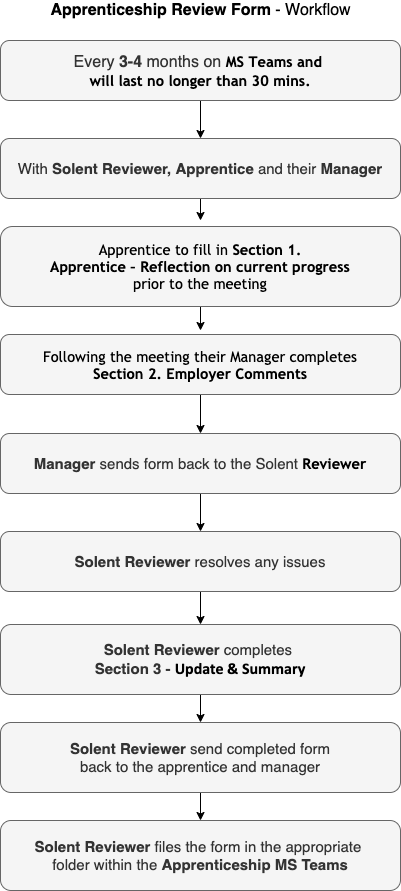

{: .no_toc }

# Apprenticeships - Reviews

Apprenticeship appraisals with apprentice and their manager. These should ideally take place every three months, but we can do them every 4 months, they can take place on online lasting between 20 and 30 minutes there is a form to be filled with contributions from the apprentice, the manager, and the university reviewer. Following the meeting if there are any issues they will need to be resolved.

[Down review from](https://ssu-my.sharepoint.com/:w:/g/personal/martin_reid_solent_ac_uk/ETKKHmQtJv9KqkEedVj8eDQBD7VkdlG5nWKRL0NL6l68qw?e=ICr0fR){: .btn .btn-purple } 

[Review strategy (work in progress)](https://ssu-my.sharepoint.com/:w:/g/personal/martin_reid_solent_ac_uk/EV637lpel7hNl5scbSJqFVMBtecFyrbgStiQcqTlX7vBXw?e=A4jKDA)