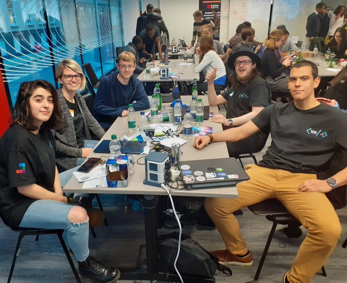

{: .no_toc }

# Student Experience 

[Student Experience](https://martinsolent.github.io/Student-Experience/){: .btn .btn-purple } 

## MSc Digital Design at Solent University

Solent University’s MSc Digital Design programme teaches students a wide range of industry-relevant skills including user experience design, front-end web development and digital marketing.

[Digital Design Showcase](https://martinsolent.github.io/Student-Experience/){: .btn .btn-purple } 
