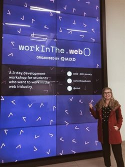
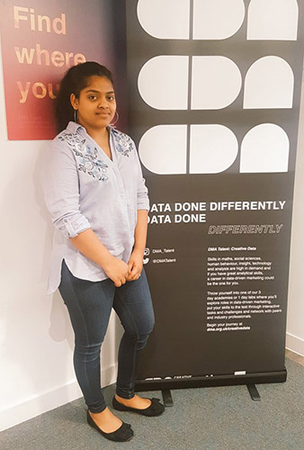
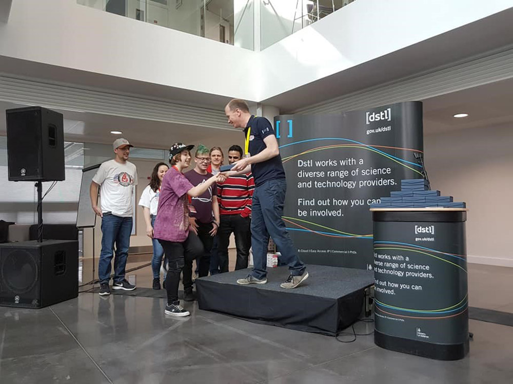

{: .no_toc }

# Computing at Solent University - Student Experience

## My Experience of The ‘Work In The Web’ Workshop

First year BSc (Hons) Web Design and Development student Kat Wlodarczyk has recently returned from a ‘Work in the Web’ workshop, designed for students wanting to get into the web industry. We caught up with Kat to find out more about her experiences, and what she learnt from the experience.

“One of my resolutions for this year was to try and say yes to new opportunities. An e-mail from my course leader about ‘A Work in the Web’ workshop was one of those opportunities so I didn’t hesitate to apply. Work in the Web is a three-day development workshop for students who want to work in the web industry.

The initiative is by an agency called Mixd, based in Leeds – and has been running since 2014. It’s their way to give back and help out new generations of programmers to learn about the industry, new skills and get the insight of what it’s like in the real dev world. This year, I was one of the 20 lucky people who successfully got a place. The event took place in Leeds, in the Mixd headquarters. When I got an acceptance letter, I was excited but also anxious about the cost of travel and accommodation. Thankfully the University gladly agreed to help out and cover the cost of train and hotel.

The workshop was a great adventure and I am so glad I was able to go and be part of it. All three days were filled with talks and panels on topics like workflow, responsive design, using the command line, launching a website and many more. On top of that, we could talk with various people who are already working in the industry, hear their stories and learn from their experience.

Spending time with like-minded people was great and very inspiring. I realised that I’m not as introvert as I think I am. The more I go and do stuff that scares me, the more I enjoy doing them.

Attending ‘Work in the Web’ has also reassured me that what we are taught in Uni, is really what we’ll be using after we graduate! It’s great to know that the course I’m undertaking has an up to date curriculum.

Lastly, I realised at the workshop that imposter syndrome happens to everybody, no matter your position or level of knowledge. So instead of trying ​to be better than other people, be better than you from the past.

I’d really recommend other computing students take part in next year’s edition of WITW - the positive vibe during the workshop is amazing and you get to connect with many talented people.”

## Anushka Monteiro was recently selected to take part in a three day creative data academy.

[https://www.solent.ac.uk/news/school-of-media-arts-and-technology/2019/student-selected-for-dma-talent-academy](https://www.solent.ac.uk/news/school-of-media-arts-and-technology/2019/student-selected-for-dma-talent-academy)

Anushka Monteiro
BSc (Hons) Web Design and Development student, Anushka Monteiro studied at Hogeschool Rotterdam, The Netherlands, as part of her second year.

"I had various opportunities to meet Dutch students, but also many other international students living there, and learned about their cultures. The programme was fun! We worked on designing an innovative solution for a real-world problem, and also enjoyed study trips to Barcelona, Antwerp and Dusseldorf. I have learned many things - the most important being how to apply what I've learned in the real world."

## Solent team achieve Innovation Award at international hackathon

Solent University recently hosted, and participated in, The Swarm and Search AI: 2019 Fire Hack – an international hackathon with a 48 hour challenge to develop algorithms and artificial intelligence necessary to control drones that could aid efforts in tackling wildfires.

Supported by experts from industry, academia, the Ministry of Defence (MoD) and the Fire and Rescue Service, participants were tasked with tackling a series of increasingly challenging scenarios using a simulated environment developed by the US Air Force Research Laboratory (AFRL). The event attracted participants from around the UK and the US, including a team from Cisco.

Prins Butt, senior lecturer and acting course leader for computing, organised and led Solent University’s Team Promise (made up of himself and six Solent students). The team were thrilled to receive the Innovation Award and came second in the hackathon overall. Prins described the event as “an important opportunity to showcase the immense skills and talent that can be found at Solent University”. 

The Solent team were commended on developing an algorithm which the judges had not seen before, as well as for their creativity.  Skip Barden, second year BSc (Hons) Web Design and Development student, designed a prototype for a mobile application which received particular mention from the judges and contributed to the team’s success in receiving the Innovation award. Summarising the experience, Skip told us: “I was really eager to take part in this, as I have a strong passion for ‘tech for good’. My knowledge of coding drones was limited, so I focused on utilising my front-end development skills in designing a mobile app that could feed information into the main algorithm. I had a great weekend with some fun memories, and will definitely attend more hackathons in the near future”.

Tobiasz Kaduk, MSc Computer Engineering student, was tasked with supporting the team in developing ideas for the algorithm as well as adding Polish language support to the software solution. Tobiasz commented: “I really did enjoy the atmosphere and wonderful people. We were working hard, but also had a lot of fun. I will never forget this outstanding event. It filled me with a lot of positive energy – a rock and roll experience!”

Each member of the team was presented with a glass trophy, an official winner’s medal and sticker.  The success of the team at the event has also inspired them to sign up for their next hackathon, taking place in the coming month.

[The Swarm and Search AI: 2019 Fire Hack](https://www.solent.ac.uk/news/solent-team-achieve-innovation-award-at-international-hackathon)

## Solent students achieve third place at Hack the South

Five Solent students recently took part in Hack the South, a 36-hour hackathon open to all students, but with a particular focus on those living and studying in the south of England. This hackathon was held in Southampton and involved teams of students hacking interesting and creative ideas into software or hardware products.

[https://www.solent.ac.uk/news/school-of-media-arts-and-technology/2019/solent-students-achieve-third-place-at-hack-the-south](https://www.solent.ac.uk/news/school-of-media-arts-and-technology/2019/solent-students-achieve-third-place-at-hack-the-south)

## Students support design and development of 'Dry January' App

Two students from Solent University recently had the fantastic opportunity to support the development of the Dry January app for Alcohol Change UK.

The app was created by local digital product studio Rareloop, and Skip Barden, currently in her second year of BSc (Hons) Web Design and Development and interning with Rareloop, and Edoardo Rainoldi, in his final year of BA (Hons) Graphic Design for Web and Mobile Devices (now BA (Hons) Graphic Design) assisted the team in the development. 

## Computing students collaborate with Oxford Innovation Centre

Solent computing students have successfully completed a two week placement in collaboration with Oxford Innovation Centre (OI Space Incubator), working directly with four business start-ups to design their UX and digital strategies.

[https://www.solent.ac.uk/news/school-of-media-arts-and-technology/2018/computing-students-collaborate-with-oxford-innovation-centre](https://www.solent.ac.uk/news/school-of-media-arts-and-technology/2018/computing-students-collaborate-with-oxford-innovation-centre)

## Agata gets practical experience in UX/UI design

For the past few months, MSc Digital Design student Agata Jurgelevic has been working as an intern at Hinge Agency as a user experience (UX) and user interface (UI) designer. She told us a little about how she got the role, and how she's finding it.

[https://www.solent.ac.uk/news/school-of-media-arts-and-technology/2019/agata-gets-practical-experience-in-ux-ui-design](https://www.solent.ac.uk/news/school-of-media-arts-and-technology/2019/agata-gets-practical-experience-in-ux-ui-design)

## Skip develops app to combat diminishing bee population

Second year BSc (Hons) Web Design and Development student Steph Barden has just returned from a summer work placement with 3 SIDED CUBE – a global app development company, and winner of Agency of the Year at the UK App Developer Awards.

[https://www.solent.ac.uk/news/school-of-media-arts-and-technology/2018/steph-develops-app-to-combat-diminishing-bee-population](https://www.solent.ac.uk/news/school-of-media-arts-and-technology/2018/steph-develops-app-to-combat-diminishing-bee-population)

## Carl's UX career at Compare the Market

Since graduating from Solent in 2015, Carl Worricker has made a career out of his degree.

After studying web design (now BSc (Hons) Web Design and Development), Carl held jobs as a web developer, product designer and content executive before joining Compare the Market last year as a UX designe

[https://www.solent.ac.uk/news/school-of-media-arts-and-technology/2019/carls-ux-career-at-compare-the-market](https://www.solent.ac.uk/news/school-of-media-arts-and-technology/2019/carls-ux-career-at-compare-the-market)

## Rising to the Dynamo Challenge

The Dynamo Challenge is an inter-university enterprise competition, which encourages students from Solent, Southampton, Bournemouth and Portsmouth Universities to think outside of the box and solve a real-life business challenge set by IBM. They have just a few hours to complete the challenge before pitching their idea to a panel of judges. BSc (Hons) Business Information Technology student, Cezara Denise Tineghe took part in this year's challenge. We caught up with her to find out what happened. 

[https://www.solent.ac.uk/news/school-of-media-arts-and-technology/2018/rising-to-the-dynamo-challenge](https://www.solent.ac.uk/news/school-of-media-arts-and-technology/2018/rising-to-the-dynamo-challenge)

## MSc Digital Design student Natasha Deacon decided to join in the challenge with only an hour to spare – and won! 

With the live episodes aimed at UI/UX designers, MSc Digital Design student Natasha Deacon decided to join in the challenge with only an hour to spare – and won! She will receive a year’s free subscription of Adobe Creative Cloud.

Entrants were tasked with designing a 3+ screen web experience for pet socials and playdates using Adobe XD and the Pawtastic UI kit that was provided.

We spoke to Natasha about her entry, and how she feels to have won. She says:

“With my design I decided to come up with something a bit more original. Although I still used some elements from the UK kit, I played around a lot with the font, colours and copy so it featured realistic content, as well as using images I downloaded from Unsplash.

“It was a very weird feeling knowing that more than 1,200 people were watching the live video from different places around the world. I was nervous about hearing not just what the hosts thought of my submission, but also what the viewers thought as they left their comments.

“It was nice (and useful!) to see and hear some great positive feedback from lots of different people from different backgrounds. All of the submissions were great and the ones I was up against were of such high quality I honestly didn’t think I would win!

“I love learning the new skills and theories that are associated with a job in UI/UX design, as this is what I want to do once I’ve completed my master’s. I’m enjoying every minute of my course and, as well as the job-related skills, I am also learning the importance of building social capital and networking with others in the industry.

“Thanks to a couple of my lecturers, who have encouraged me to attend events and reach out to professionals to build relationships, I have come across some great opportunities as well as prepare a great deal for life after uni, especially in terms of my career path.”

You can view Natasha’s winning prototype [here.](https://xd.adobe.com/view/5a9a1829-184b-40b4-6545-9c7871a02de8-2cab/?fullscreen)

 

[https://www.solent.ac.uk/news/student-wins-adobe-challenge](https://www.solent.ac.uk/news/student-wins-adobe-challenge)

