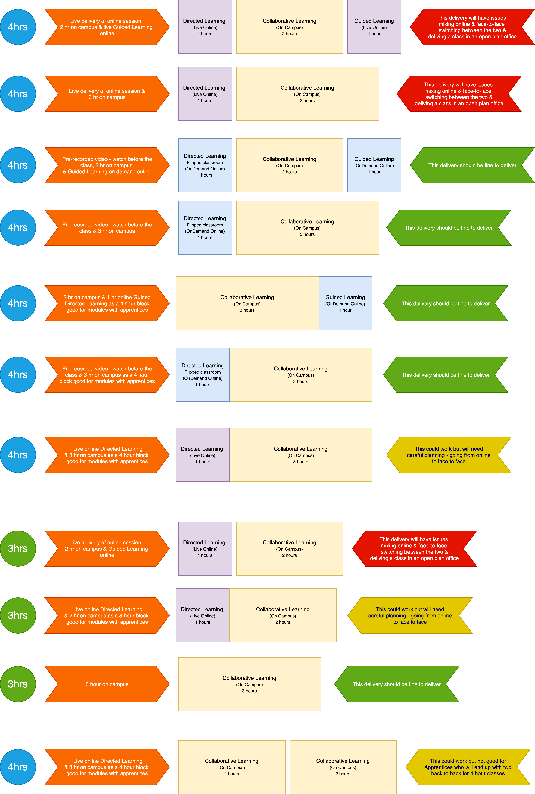

{: .no_toc }

# Teaching - Hybrid Delivery Options

The three pillars of learning and teaching at Solent
There are 3 main pillars of learning at Solent:

* Directed Learning
* Collaborative Learning 
* Guided Learning

Directed and Collaborative Learning is what we have always known as "contact time", and is learning that is made possible through a Course Team's academic delivery of the subject area.

[Transformation Academy](https://learn.solent.ac.uk/course/view.php?id=37138#)

Below are delivery options for hybrid learning as well as pure me face-to-face teaching. in line with the guidance offered on the Transformation Academy SOL.

**Hybrid learning issues**

One of the main issues of delivering hybrid learning is having to switch between online live and face-to-face campus delivery. Staff and students ending up with a mixture of online learning and face-to-face learning in the same day, defeats the benefits that the hybrid approach can offer.

There is a likelihood that your presentation/lecture will be timetabled after your practical sessions also it could mean that apprenticeship students have the classes disconnected so they may end up with a session being timetabled on the day they do not come to uni (see below)

**Flipped classroom**

Flipping your classroom which will mean creating a pre-record video that students watch before they attend your practical class could solve some of the issues, though there is a danger these videos will not be watched and so students will turn up unprepared.

**Apprenticeship students**

Also for apprenticeship students they need to have all the delivered classes on one day (2x modules) so the best delivery for them would be an online presentation for the first hour this could be live or pre-recorded so the apprentices can be on campus to either, watch the pre-recorded video or watch - it live  and be given time for this i.e. 9 am - 10 am before moving to the practical class.

**Remember** if you have a Timetable session which is Directed Learning Online and On Demand - flipped classroom approach with students watching a pre-recorded video - this goes on your timetable as if it was delivered live/face-to-face - as you still need to do the prep work and delivery

The flipped Classroom approach does mean more preparation and also careful duration of the learning journey in advance

[Download Diagram](ACS_slides/comp_delivery_options_v2.png)

